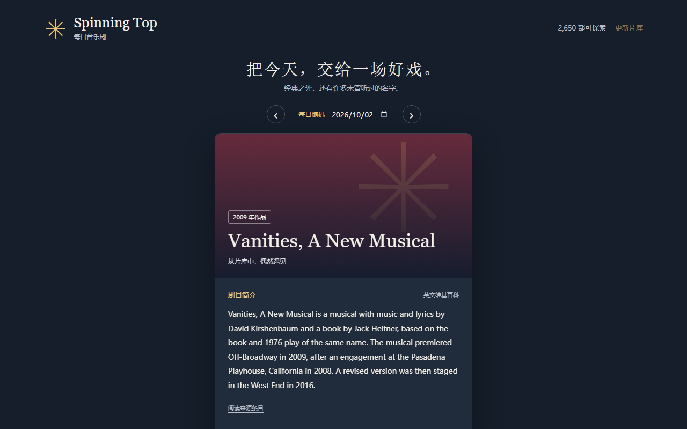

<div align="center">


# Spinning Top · 每日音乐剧

**Discover one musical a day from a curated 2,650-title catalogue.**

**Status:** ⚪ Experimental

[Live Site](https://styayur.github.io/musical-spinningtop/) · [Documentation](docs/data-provenance.md) · [Releases](https://github.com/styayur/musical-spinningtop/releases) · [Issues](https://github.com/styayur/musical-spinningtop/issues)

[](https://github.com/styayur/musical-spinningtop/actions/workflows/ci.yml)
[](LICENSE)
[]()
[]()
[]()



</div>

## 已实现

- **每日抽取**：每天第一次访问时，使用 `secrets.choice`（操作系统提供的安全随机源）等概率抽取一部，并把剧目快照保存到 SQLite。刷新页面、重启、更新片库都不会改变该日结果。
- **不放回抽取**：每日片单和“再抽一部”分别维护已抽记录；每轮覆盖全部可用剧目，耗尽后开启新一轮。每轮交界避免连续重复（仅一部可用时除外）。两种模式之间可能遇到同一部。
- **真正的大型来源片库**：附带从 Wikipedia 的 156 个年份分类抓取、按页面 ID 去重的片库。收录经典、冷门及不同国家的作品；保留原始条目链接，不编造剧名或官网。
- **离线可用**：片库和超过 2,600 篇百科摘要随程序附带。联网时后台更新当前作品资料；断网时仍可抽取并阅读已有摘要。图片是外部链接，未下载的图片离线不可用。
- **日期回看**：左右按钮或日期选择器查看其他日期，点击“回到今日”返回。尚未打开过的日期在第一次查看时抽取，包括过去和未来日期；它不是历史演出档案。
- **片库更新**：点击“更新片库”启动后台全量抓取。独立运行时，片库超过 7 天会在启动时自动更新；完整抓取成功后才替换，失败保留现有片库。页面显示进度、错误和实际条目数。
- **翻转卡片**：点击封面或“翻面看链接”，查看百科、已收录官网和演出搜索。支持键盘、手机、减少动态效果偏好和请求失败重试。

## 网站版与本地版

网站发布在 [GitHub Pages](https://styayur.github.io/musical-spinningtop/)，无需 Python。浏览器使用 `crypto.getRandomValues` 和拒绝采样避免取模偏差，使用 IndexedDB 事务保存每日结果与抽取周期。每日日期以浏览器所在时区为准；同一浏览器的多个标签页共享记录，不同浏览器/设备分别保存，清除网站数据会重置历史。

网站首次下载片库后保存数据缓存，后续可在数据接口暂时不可用时继续抽取。它没有离线应用壳：完全断网时重新打开网页仍取决于浏览器对页面本身的缓存。网站的“检查片库更新”下载最新发布快照；Python 本地版则直接从 Wikipedia 抓取。网页摘要使用发布时附带的数据，实时获取中文简介请使用本地版。网站图片仍需要访问外部图片地址。

GitHub Actions 在每次推送 `main` 后执行后端与浏览器测试，再部署网站；每周一 UTC 04:23 尝试重抓片库与摘要并部署。定时抓取失败会保留上一版网站。定时快照通过网站的 `data/site-catalog.json` 提供，不自动提交到仓库，Release 中的数据保持发布时版本。

构建网站：

```powershell
.venv\Scripts\python.exe build_site.py
python -m http.server 8080 --directory _site
```

部署内容仅包含公开片库、前端资源和 LICENSE，**不包含本机抽取历史或 SQLite 数据库**。网站持续提供仓库完整源码入口；代码采用 AGPL-3.0-only，资料按各自许可标注。

## 运行

需要 **Python 3.9+**（本次在 Windows / Python 3.14 验证）。

```powershell
python -m venv .venv
.venv\Scripts\python.exe -m pip install -r requirements.txt
.venv\Scripts\python.exe app.py
```

macOS / Linux 使用 `.venv/bin/python`。程序默认仅监听本机 `127.0.0.1:5000`。

```powershell
.venv\Scripts\python.exe app.py 8000 --no-browser
```

环境变量：`PORT` 指定端口，`NO_BROWSER=1` 关闭自动打开浏览器，`SPINNINGTOP_DATA_DIR` 指定运行数据目录（默认 `data/runtime`）。

## 随机与存储规则

这里的“随机”是操作系统安全随机源提供的随机抽样，不是按日期取模、热门推荐或固定种子排序。每次从当前模式尚未抽过的剧目集合中均匀抽取。每日结果按运行程序的电脑本地日期分组，同一运行数据目录的使用者共享结果，不同安装各自随机。页面停留在今日时，每分钟检查是否跨日；历史浏览不会自动跳走。

SQLite 的 `BEGIN IMMEDIATE` 事务确保多个标签页或并发请求不会为同一天生成不同结果。更新片库后新增剧目可进入未抽集合，已保存日期不受影响。不要删除 `data/runtime/spinningtop.sqlite3`，否则每日记录、已抽记录和动态资料缓存会重置。

自由抽取使用 POST：同一次请求成功返回一部。不为网络中断的 POST 自动重试，以免重复消耗抽取记录。

## 数据范围与来源

附带快照于 **2026-09-25** 抓取。候选来源为英文 Wikipedia 的 [Musicals by year](https://en.wikipedia.org/wiki/Category:Musicals_by_year)，仅遍历形如 `Category:2026 musicals` 的直接年份分类，完整处理 API 分页；不递归进入音乐电影分类。原始候选 2,676 条，另排除 26 条已识别的小说、电影、电视节目、唱片或团体主条目，实际片库为 2,650 条。排除理由记录在 `data/exclusions.json`，每次更新同样应用。

这不是全球所有音乐剧的完整名录，也不是某地区当前正在演出的剧目列表。来源分类包含部分轻歌剧、歌舞综艺、概念音乐剧等相邻形式；分类、年份和资料完整性取决于来源的社区维护。年份取所属年份分类的最早值，不应理解为统一的百老汇首演年份。

简介优先读取中文 Wikipedia；没有中文条目时使用已有中文摘要或明确标注的英文摘要。取消了原先没有请求超时的免费翻译调用，不把百科摘要称为“官方简介”。可展开英文原文、点击来源核对。部分条目没有简介或可用海报，会显示清楚的占位说明；所有图像均为条目提供的题图，并不保证是剧照。

官网仅使用原有人工补充的链接，可能随时间失效；其余剧目提供“查找官网与演出”。Fever 按钮是 Google 对 `feverup.com` 的站内搜索，**不代表已找到当前演出或余票**。

抓取遵循 [MediaWiki Categorymembers](https://www.mediawiki.org/wiki/API:Categorymembers) 与 [Continue](https://www.mediawiki.org/wiki/API:Continue) 协议：最多 3 个并行连接、请求超时、一次重试、明确 User-Agent。摘要以 20 个页面为一批抓取。详情请求合并去重，最多排队 12 部；成功缓存 7 天，失败冷却 5 分钟。

## 文件与维护

| 文件 | 用途 |
| --- | --- |
| `build_site.py` | 生成 GitHub Pages 网站到 `_site/` |
| `static/static-api.js` | 浏览器安全随机与 IndexedDB 存储 |
| `.github/workflows/pages.yml` | 测试、定时片库更新与网站部署 |
| `app.py` | Flask 接口、SQLite 抽取、后台详情缓存 |
| `catalog.py` | 分页抓取、去重、原子发布完整片库 |
| `cache_articles.py` | 重建可随程序分发的离线摘要 |
| `data/catalog.json` | 随程序附带的真实剧目快照 |
| `data/articles.json` | 附带英文摘要、部分中文名、图片和出处链接 |
| `data/musicals.json` | 人工补充的中文名、创作者与官网信息 |
| `data/exclusions.json` | 已核对的非目标条目及排除理由 |
| `data/runtime/` | 本机数据库、更新后的片库，不提交 Git |
| `tests/` | 后端回归和浏览器功能测试 |

重建分发用快照（需要联网；中途失败不会覆盖旧文件）：

```powershell
.venv\Scripts\python.exe catalog.py
.venv\Scripts\python.exe cache_articles.py
```

日常使用点击界面的“更新片库”即可，更新保存在运行目录。人工补充信息通过 `wiki` 字段匹配真实条目；增加新的抽取作品应通过来源分类或维护 `data/catalog.json` 中有明确来源的记录。

## 接口与测试

- `GET /api/musical`：今天；可选 `date=YYYY-MM-DD` 或兼容旧版 `offset=-1`。
- `POST /api/random`：自由抽取，不改变今日结果。
- `GET /api/details?id=en:页面ID`：当前资料缓存及加载状态。
- `GET /api/catalog`：规模、更新时间、同步进度和本机今日日期。
- `POST /api/catalog/refresh`：启动后台更新（60 秒内不重复启动）。

```powershell
.venv\Scripts\python.exe -m unittest discover -s tests -v
# 浏览器测试：另开终端运行应用，再执行（测试期间会产生抽取记录）
python -m pip install playwright
python -m playwright install chromium
python tests/browser_smoke.py http://127.0.0.1:5000
# 网站版回归测试（先运行 build_site.py）
python tests/site_smoke.py
```

测试覆盖不重复抽取、所有候选可达、跨实例持久化、并发同日一致性、无网络首屏、错误日期、更新失败回退、分页去重、中文来源与英文回退，以及桌面和移动端交互。统计检验不能证明随机源的物理随机性；实现直接使用系统随机源，而不是手写伪随机公式。

## 数据来源与重建

当前片库与摘要快照日期、条目数量、抓取命令和许可证边界见 [docs/data-provenance.md](docs/data-provenance.md)。运行 `python scripts/validate_catalog.py` 会在不联网的情况下检查重复 ID、重复 Wikipedia 页面 ID、标题冲突、缺失摘要和来源链接。`data/runtime/` 与 SQLite 数据库属于本机运行数据，不应提交到 Git。

## Roadmap

### Current

- One-musical-a-day draw over a 2,650-title catalogue with offline summaries.

### Next

- Refresh the catalogue pipeline and stabilise the static web edition.

### Future

- Additional discovery modes and metadata views.

### Not planned

- Audio streaming or downloading copyrighted recordings; user accounts.

## 参与开发与反馈

- 开发、数据变更规范和测试命令见 [CONTRIBUTING.md](CONTRIBUTING.md)。
- GitHub Issues：可复现 bug 与范围明确的功能请求。
- Discord：[加入社区](https://discord.gg/wA2xy6VPK)，用于快速交流、设计讨论与早期反馈；不是 SLA 支持渠道。
- Security：按 [SECURITY.md](SECURITY.md) 私下报告，不要开公开 Issue。
- Release 使用与项目当前 CHANGELOG 兼容的 SemVer/tag 习惯；维护者负责发布与 Pages 部署。

## 许可

程序代码为 [AGPL-3.0](LICENSE)。附带 Wikipedia 文字摘要按 [CC BY-SA 4.0](https://creativecommons.org/licenses/by-sa/4.0/) 使用；为截短摘录，原条目和贡献者历史可通过每条 `intro_source` 链接访问。摘要数据文件包含许可说明。图片未打包下载，其各自许可、作者与使用条件见 `image_source` 文件页面，可能涉及非自由图片；代码许可不替代内容本身的许可。
